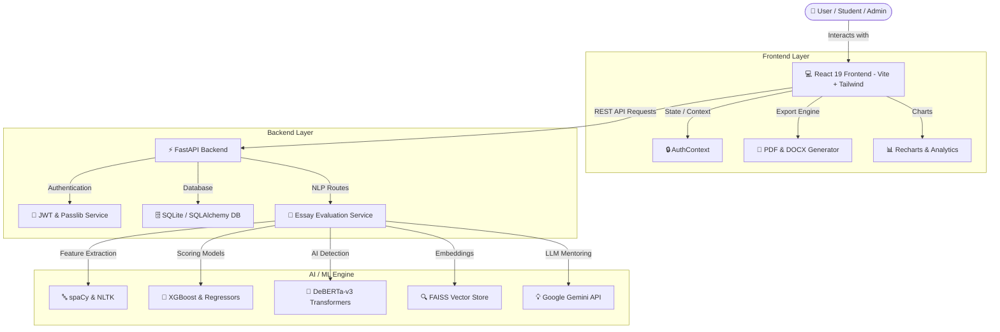

# 🎓 IntelliScore AI — Explainable Automated Essay Evaluation & Learning Analytics Platform

<p align="center">
  
  
  
  
  
  
  
  
</p>

---

## 🌟 Overview

**IntelliScore AI** is a state-of-the-art, **Explainable AI (XAI) Platform** designed for **Automated Essay Evaluation (AES)**, **Writing Diagnostics**, **Academic Integrity & AI Content Detection**, **Semantic Essay Comparison**, and **Real-Time Student Analytics**. 

Engineered with production-ready software engineering standards, modular NLP pipelines, and modern web interfaces, IntelliScore AI provides students, educators, and institutions with actionable, multi-dimensional feedback to elevate academic writing quality.

---

## ✨ Key Features & Capabilities

### 📝 1. Multi-Dimensional Automated Essay Scoring (AES)
- **Granular Sub-Score Analytics**: Evaluates essays across 6 core linguistic domains:
  - 🧠 **Coherence & Flow**
  - 📚 **Vocabulary Richness**
  - 📖 **Readability & Complexity**
  - 🏗️ **Structural Organization**
  - 🎨 **Writing Style & Clarity**
  - ✍️ **Grammar & Mechanics**
- **Machine Learning Engine**: Powered by XGBoost, scikit-learn regressors, and spaCy feature extraction pipelines.

### 🛡️ 2. Academic Integrity & AI Detection
- **AI Content Identification**: Detects content generated by LLMs (ChatGPT, Claude, Gemini) using DeBERTa-v3 transformers and perplexity/burstiness analysis.
- **Plagiarism & Syntactic Diagnostics**: Highlights repetitive patterns, unnatural phrasing, and potential integrity flags with concrete scoring metrics.

### 💡 3. AI Writing Mentor & Live Grammar Fixes
- **Interactive Grammar & Spell Checker**: Sentence-level error detection powered by NLTK, spaCy, and custom NLP rule engines.
- **One-Click Targeted Rewrites**: Instantly apply sentence rewrites, recalculate scores in real time, and persist draft revisions.

### 📊 4. Semantic Essay Comparison Engine
- **Side-by-Side Matching**: Compares two essay drafts using Sentence-Transformers (`all-MiniLM-L6-v2`) and cosine similarity metrics.
- **Vector Space Analysis**: Utilizes FAISS vector stores for embedding lookups and structural overlap detection.

### 📄 5. Custom High-Fidelity Report Exports
- **Native PDF & DOCX Generators**: Built with `docx`, `jsPDF`, and `html2canvas` for crisp, professional document exports.
- **Tailored Report Types**: Filter exported content by **Comprehensive**, **Scoring**, **Integrity**, or **Comparison** modes.

### 👥 6. Role-Based Access & Telemetry Dashboard
- **Admin Management Portal**: Real-time user registration telemetry, active student directory, and profile control system.
- **Secure Authentication**: JWT token authentication with bcrypt password hashing and dedicated admin privileges.

---

## 🏗️ System Architecture



---

## 🛠️ Technology Stack

| Domain | Technologies Used |
| :--- | :--- |
| **Frontend SPA** | React 19, TypeScript, Vite 8, Tailwind CSS v4, Framer Motion, Lucide React, Recharts |
| **Document Generation** | `docx`, `jsPDF`, `html2canvas` |
| **Backend REST API** | FastAPI, Python 3.10+, SQLAlchemy, Pydantic v2, Uvicorn, PyJWT |
| **Machine Learning & NLP** | PyTorch, HuggingFace Transformers (DeBERTa-v3), Sentence-Transformers, spaCy, NLTK, XGBoost, scikit-learn |
| **Vector Search & LLM** | FAISS Vector Store, LangChain, Google Gemini API |
| **Build & Testing** | PowerShell Automation, Pytest, Oxlint |

---

## 📁 Repository Structure

```
intelliscore-ai/
├── backend/                  # FastAPI Application
│   ├── app/
│   │   ├── api/v1/routes/    # Auth, Essays, and Chat API Endpoints
│   │   ├── core/             # Security, JWT, and Configuration
│   │   ├── db/               # Database Session and Models
│   │   ├── models/           # SQLAlchemy Data Models
│   │   ├── schemas/          # Pydantic Request/Response Schemas
│   │   └── services/         # NLP, Scoring, and Telemetry Logic
│   └── tests/                # Pytest Test Suites
├── frontend/
│   ├── react-app/            # Main React 19 Single Page Application
│   │   ├── src/
│   │   │   ├── components/   # Modular UI Components & Layouts
│   │   │   ├── context/      # Auth & Application State
│   │   │   ├── lib/          # API Clients & Document Export Engine
│   │   │   └── pages/        # Dashboard, Analysis, Reports, Settings
│   └── streamlit_app/        # Alternative Streamlit Data Science UI
├── ml/                       # Framework-Agnostic ML/DL Modules
│   ├── embeddings/           # Sentence Transformers & FAISS Embeddings
│   ├── features/             # Linguistic & Stylistic Feature Extractors
│   ├── nlp/                  # Grammar, Spellcheck, and AI Detectors
│   └── scoring/              # Sub-score Aggregators & Predictors
├── config/                   # Application Configuration Specs
├── docs/                     # Architecture & Module Specifications
├── start.ps1                 # Automated Windows Startup Script
└── README.md                 # Project Overview & Guide
```

---

## 🚀 Quick Start Guide

### 📋 Prerequisites
- **Python**: `3.10+`
- **Node.js**: `18.0+`
- **Git**

### 1️⃣ Clone the Repository
```bash
git clone https://github.com/Dilipkumar-AI-Engineer/Intelliscore_AI.git
cd Intelliscore_AI/intelliscore-ai
```

### 2️⃣ Backend Setup
```bash
# Create and activate virtual environment
python -m venv .venv
.venv\Scripts\activate       # On Linux/macOS: source .venv/bin/activate

# Install dependencies
pip install -r requirements/dev.txt

# Configure environment variables
cp .env.example .env
# Edit .env and configure JWT_SECRET_KEY and GEMINI_API_KEY

# Launch FastAPI Backend (Port 8000)
cd backend
uvicorn app.main:app --reload --host 0.0.0.0 --port 8000
```

### 3️⃣ Frontend Setup
```bash
# In a new terminal tab/window:
cd frontend/react-app

# Install npm dependencies
npm install

# Start Vite Development Server (Port 5173)
npm run dev
```

---

## 🔗 Active Endpoints & Port Summary

| Application | URL | Description |
| :--- | :--- | :--- |
| **React Web App** | [http://localhost:5173](http://localhost:5173) | Main Application User Interface |
| **FastAPI Backend** | [http://localhost:8000](http://localhost:8000) | REST API Service Root |
| **Swagger API Docs** | [http://localhost:8000/docs](http://localhost:8000/docs) | Interactive API Documentation |
| **Streamlit App** *(Optional)* | [http://localhost:8501](http://localhost:8501) | Streamlit Prototyping UI |

---

## 🧑‍💻 Developer & Author

Developed with passion by **Dilipkumar**:
- 🐙 **GitHub**: [@Dilipkumar-AI-Engineer](https://github.com/Dilipkumar-AI-Engineer)
- 📦 **Repository**: [Intelliscore_AI on GitHub](https://github.com/Dilipkumar-AI-Engineer/Intelliscore_AI)

---

## 📜 License

This project is licensed under the **MIT License** — see the [LICENSE](LICENSE) file for details.
